[CH01 01 統計名詞解釋 - YouTube](https://www.youtube.com/watch?v=Hw5vEfCH_rU&feature=youtu.be)

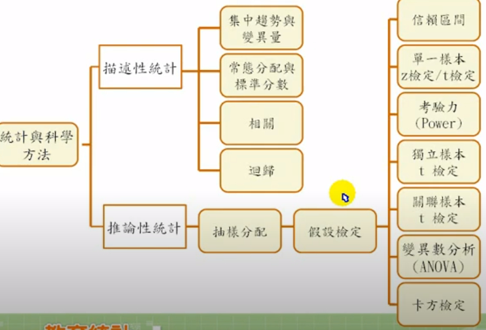

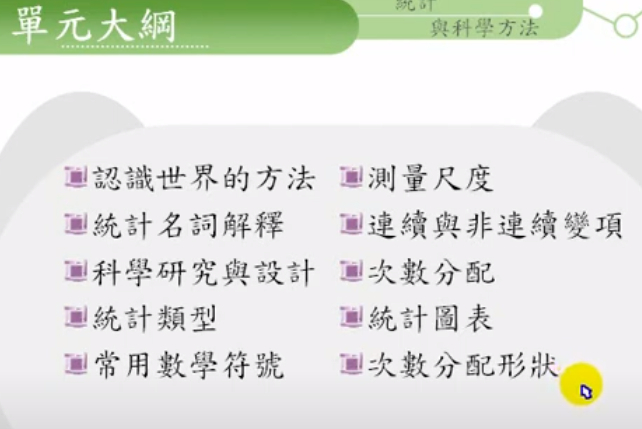

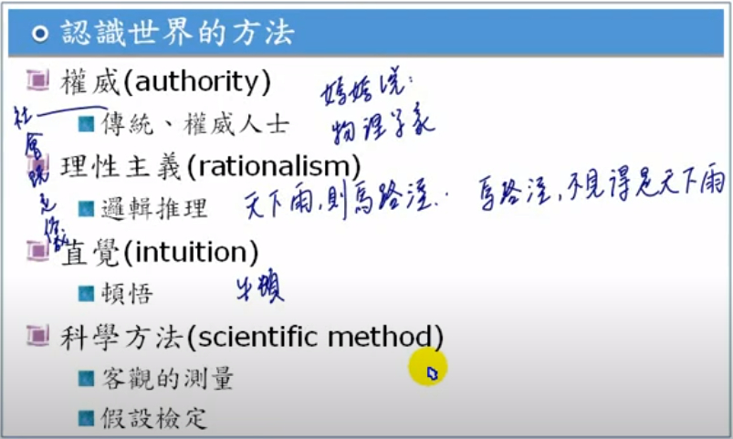

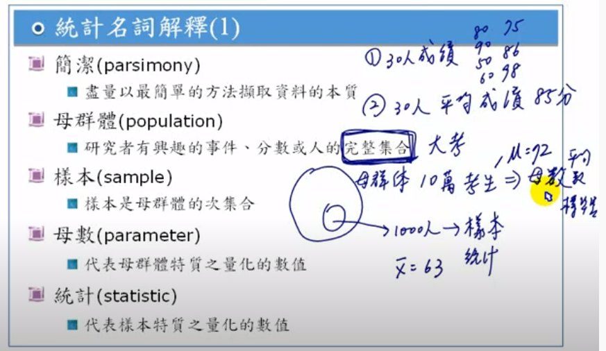

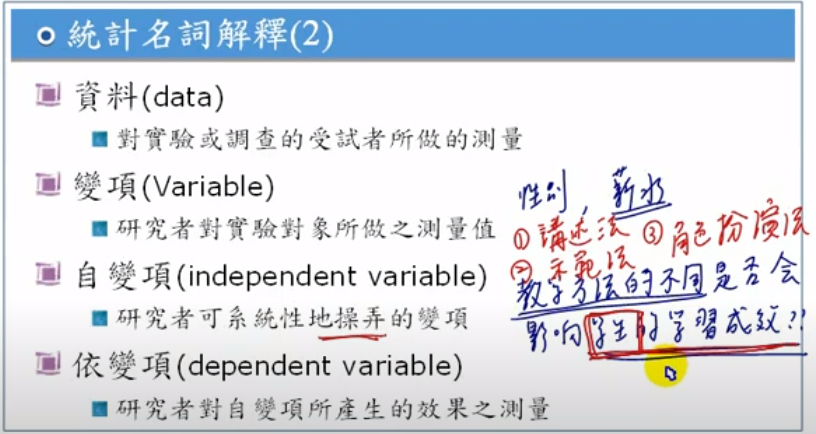

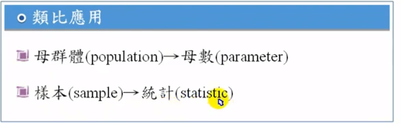

[CH01 02 科學研究與設計 - YouTube](https://www.youtube.com/watch?v=C4gtG0oUncE&feature=youtu.be)

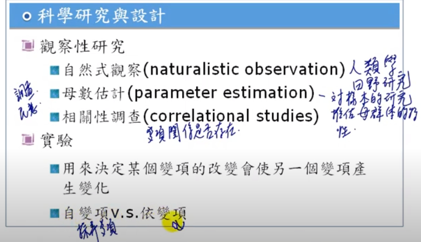
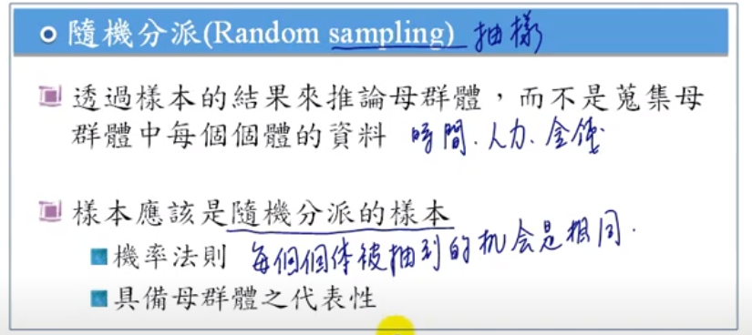
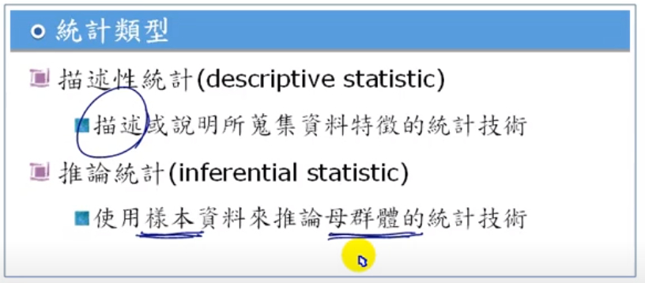
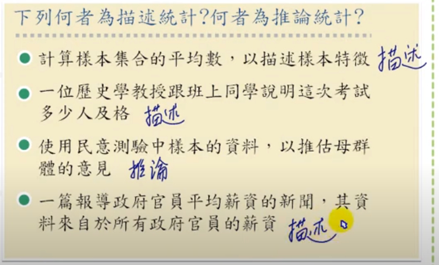

[CH01 03 常用的數學符號 - YouTube](https://www.youtube.com/watch?v=39sR4HC5cJA&feature=youtu.be)

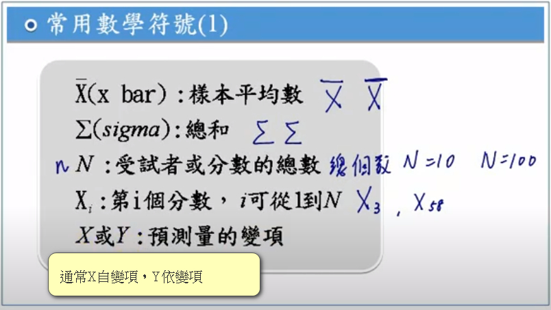
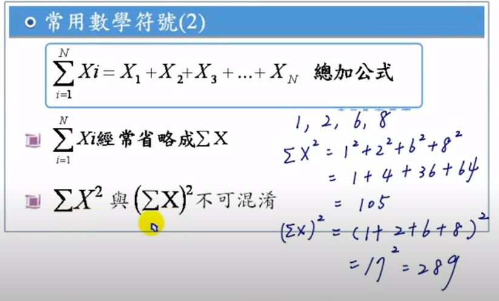

### ch01-04 尺度
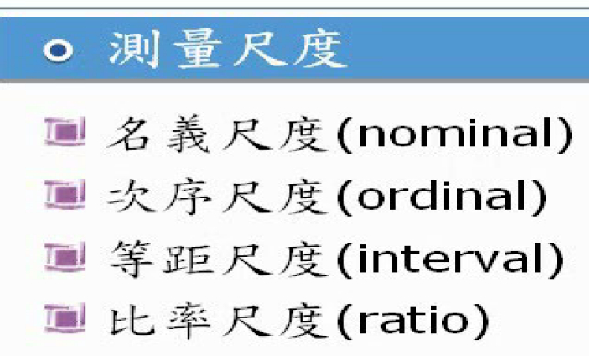
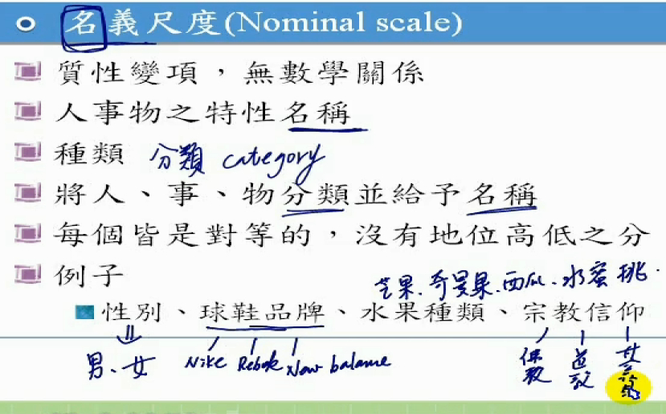
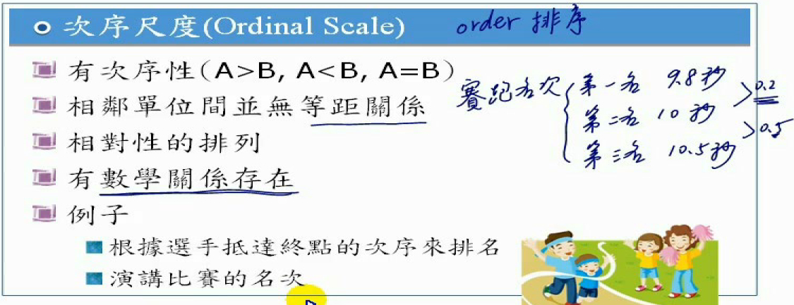
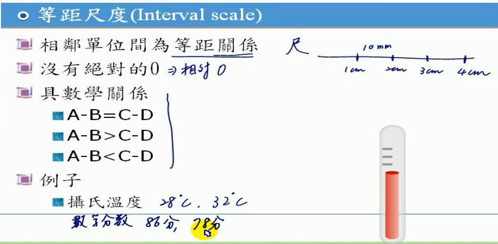
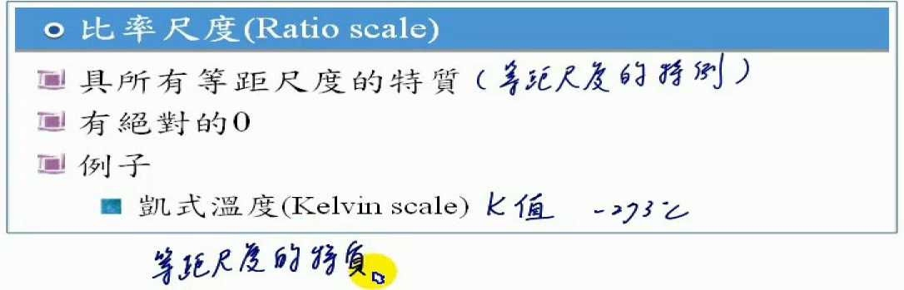
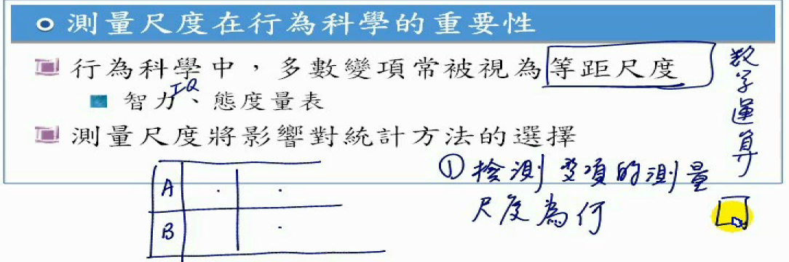

[CH01 05 連續與非連續變項 - YouTube](https://www.youtube.com/watch?v=er_amJ2jO0Q&feature=youtu.be)

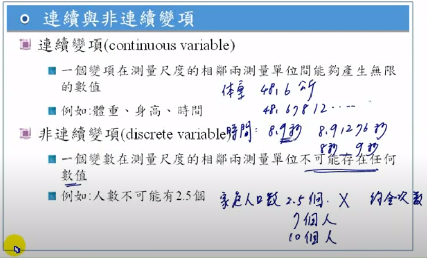

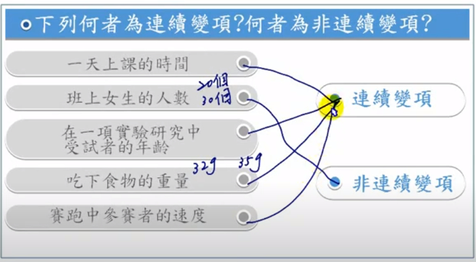

[CH01 06 統計圖表 - YouTube](https://www.youtube.com/watch?v=hT0KRE1kwp4&feature=youtu.be)

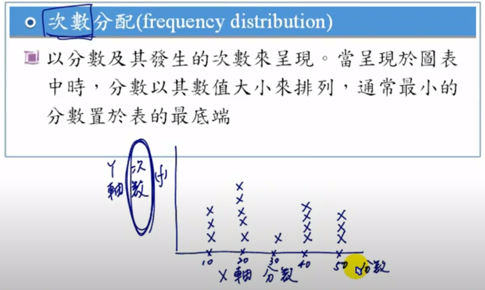

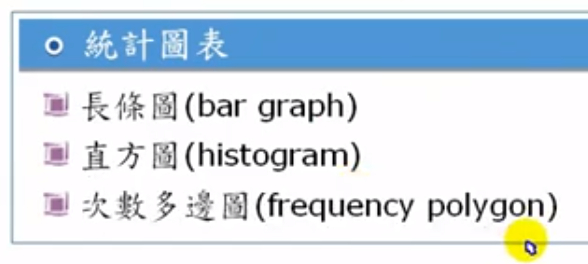

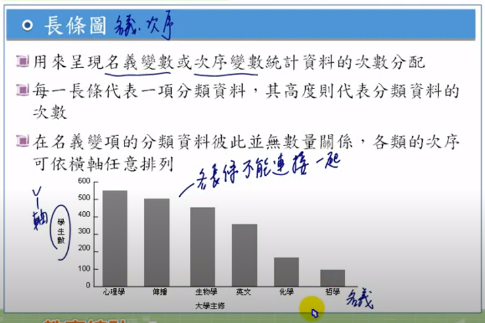

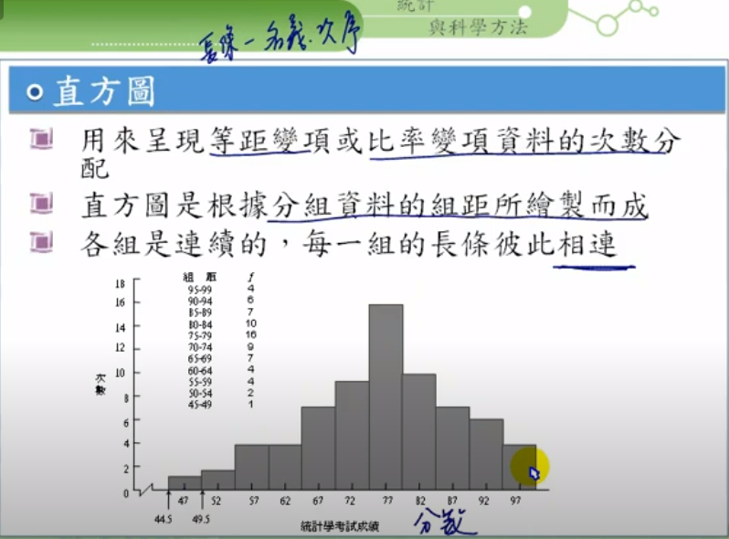

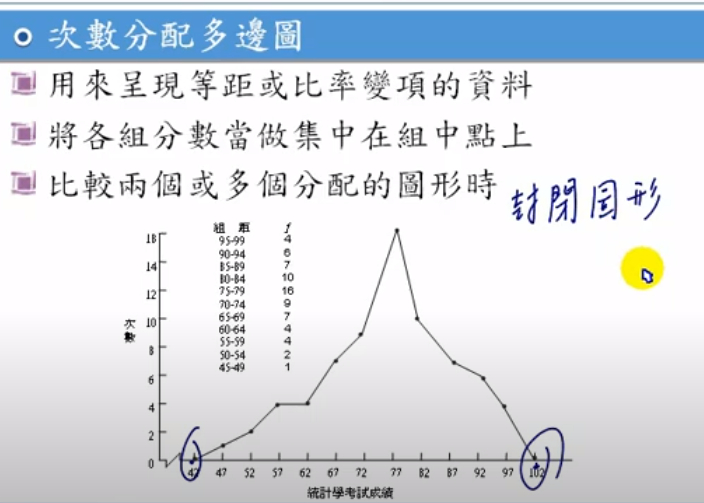

[CH01 07 各種分配的形狀 - YouTube](https://www.youtube.com/watch?v=hT5tporOulM&feature=youtu.be)

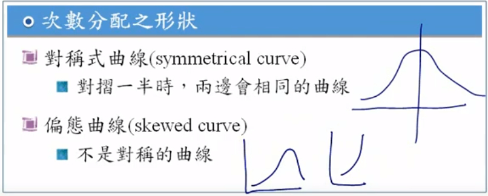

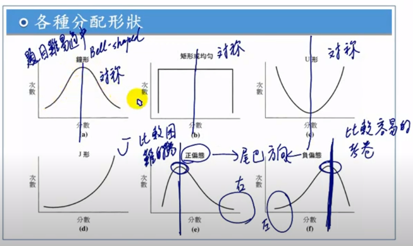

