[CH02 01 集中趨勢與變異性的定義 - YouTube](https://www.youtube.com/watch?v=YhLxiIM0EPw&feature=youtu.be)

[CH02 02 集中趨勢的測量與分配形狀 - YouTube](https://www.youtube.com/watch?v=FvbnbjFolXI&feature=youtu.be)

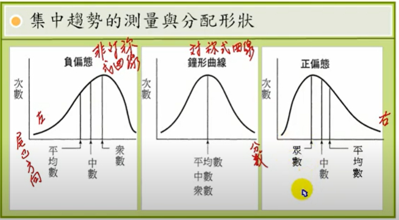

[CH02 03 離均差 - YouTube](https://www.youtube.com/watch?v=TsRHJSiWFb8&feature=youtu.be)

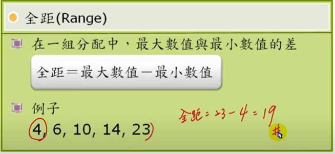
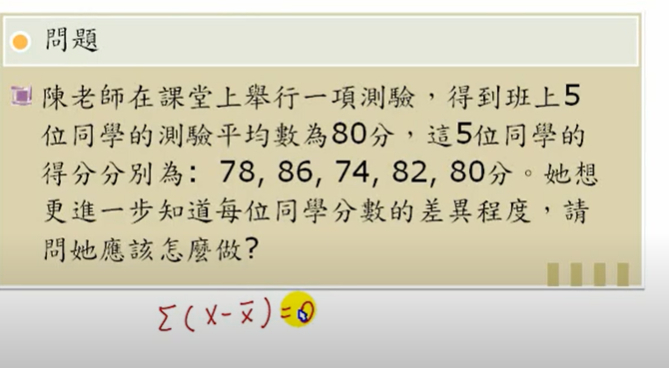
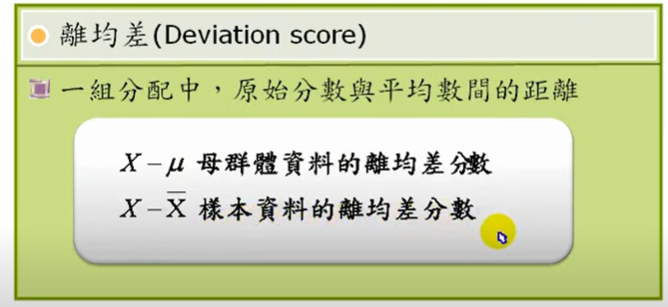
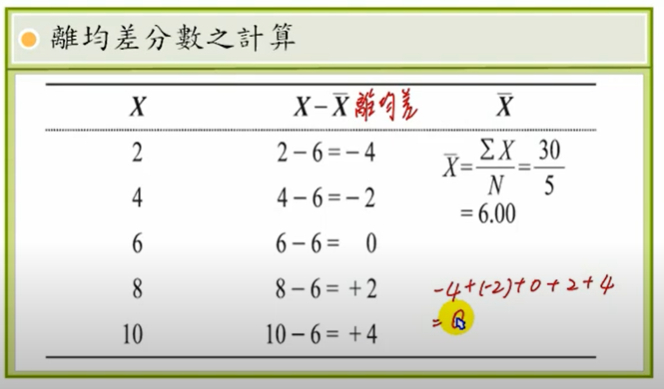
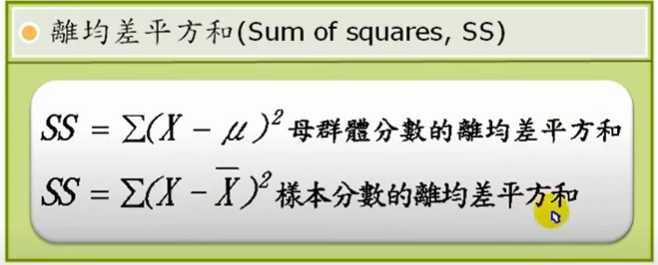

[CH02 04 標準差 - YouTube](https://www.youtube.com/watch?v=e8i78dIJKR8&feature=youtu.be)

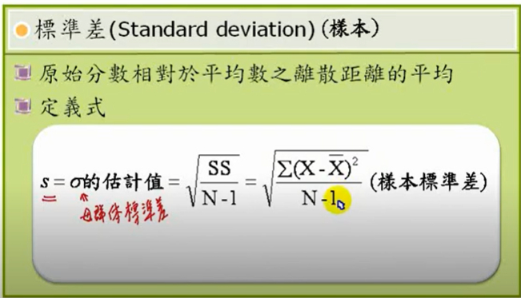
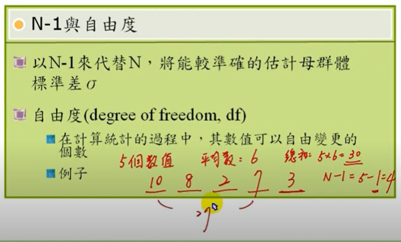
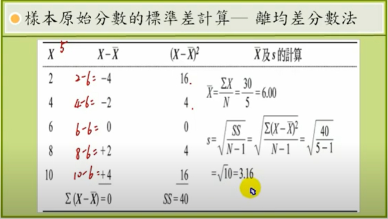

[CH02 05 SS計算式 - YouTube](https://www.youtube.com/watch?v=6MkeFL8D_hA&feature=youtu.be)

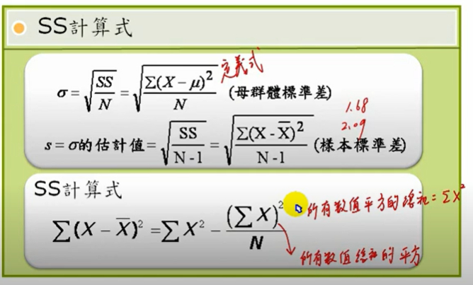
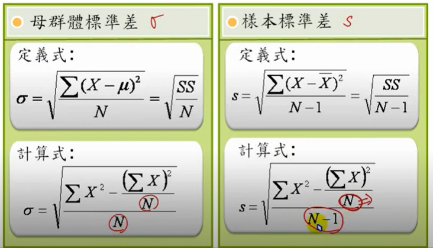

[CH02 06 變異性測量 - YouTube](https://www.youtube.com/watch?v=9c1znsXSKVg&feature=youtu.be)

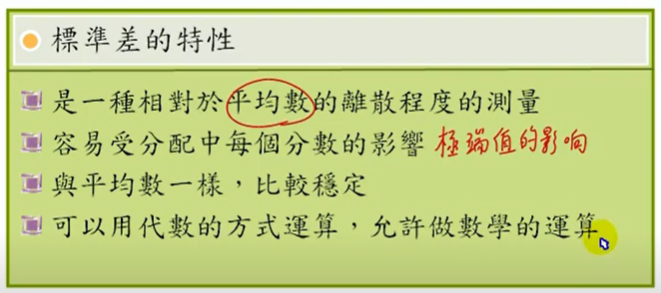
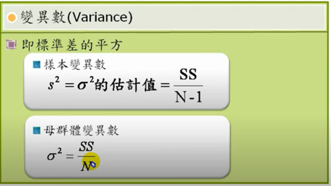
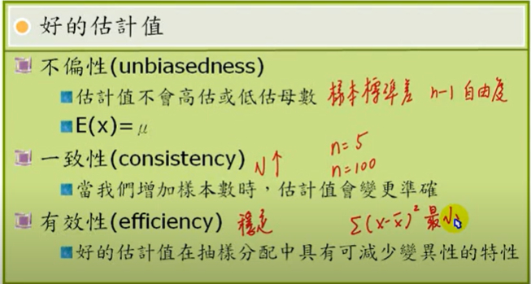

[CH02 07 計算 - YouTube](https://www.youtube.com/watch?v=P7DiT4U8BfU&feature=youtu.be)

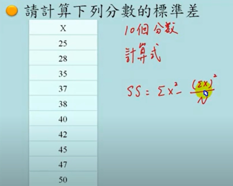
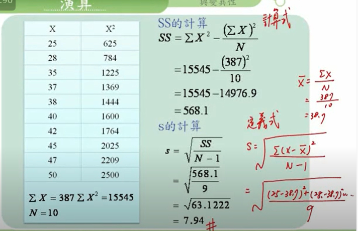

