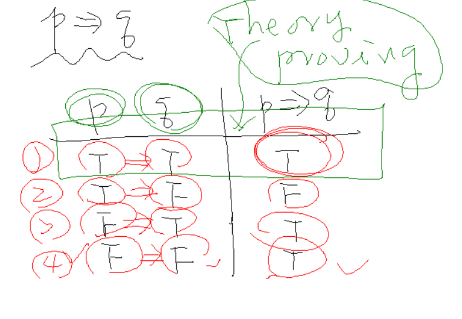
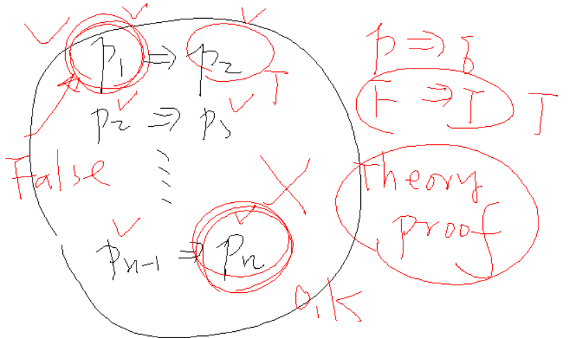
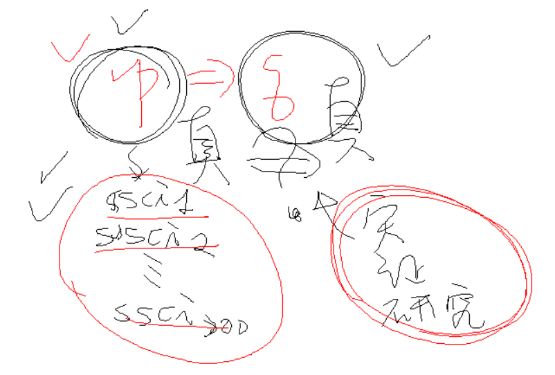
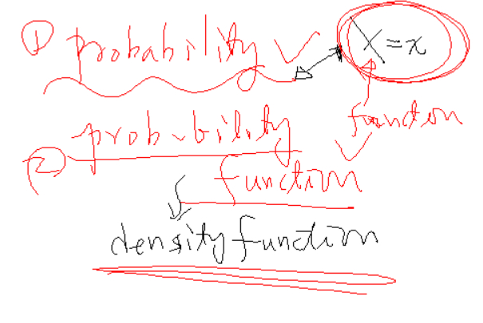

一、symbolic logic

二、學 AI，要會離散數學，這個叫符號邏輯。

三、講解真值表

四、講解 論文的推證，如果一開始錯，就全錯的故事

五、教育統計的推論

人家已經完全寫出來的論文，去證明他的結論是真

用實證研究，用問卷、統計的方法，來驗證這個統計結果是真的

工學院的論文越少越好，表示這是真的

教育學界，要讀幾百篇的論文，要用很嚴謹的方法，去證明這是真的

六、SPSS，有提到這個工具軟體

七、講解這兩個單字

