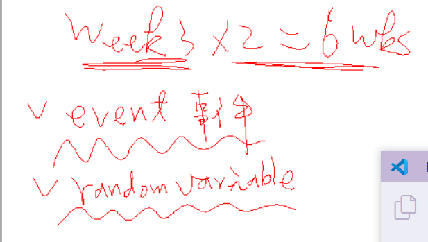
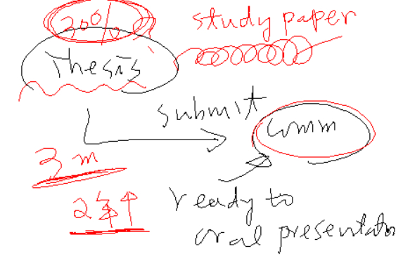

一、symbolic logic

二、學 AI，要會離散數學，這個叫符號邏輯。

三、講解真值表


四、講解 論文的推證，如果一開始錯，就全錯的故事


五、教育統計的推論

人家已經完全寫出來的論文，去證明他的結論是真

用實證研究，用問卷、統計的方法，來驗證這個統計結果是真的

工學院的論文越少越好，表示這是真的

教育學界，要讀幾百篇的論文，要用很嚴謹的方法，去證明這是真的


六、SPSS，有提到這個工具軟體



七、講解這兩個單字


八、碩士論文



```
這個拿來之後，就準備口考了，寫的過程，也沒
有好好跟我 meeting, 這個文章亂七八糟，改論文
至少要三個月，從二年級開始時，就要開始 meeting
要送給圖書館，怕您抄襲，看相似度有多高，高的話，就把部份文章重寫
要開始 study 別人的論文
花1年寫論文，會比較輕鬆
花1、2個月，寫論文，會比較緊張


```


