[演講02A 以機器學習識別風險學生的缺陷及挑戰-以12門大學一年級課程為例 - YouTube](https://www.youtube.com/watch?v=HMKwvp6fUGs&feature=youtu.be)
# 01

# 02

# 03

# 04
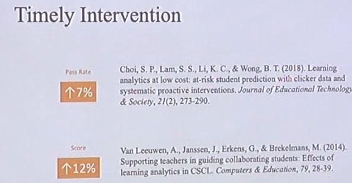

# 05
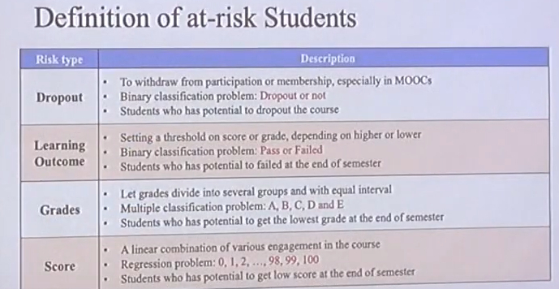

# 06

# 07
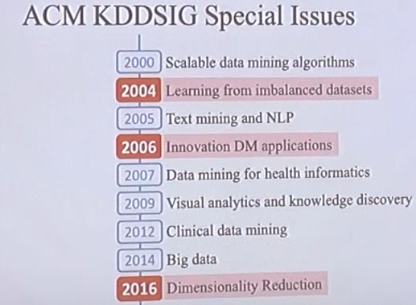

# 08

# 09
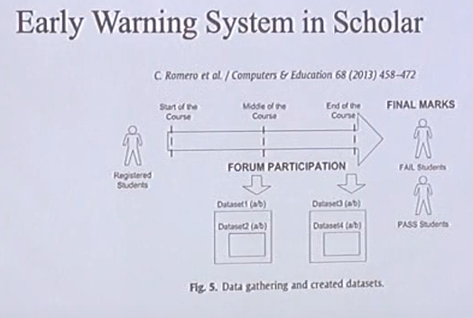

# 10

# 11
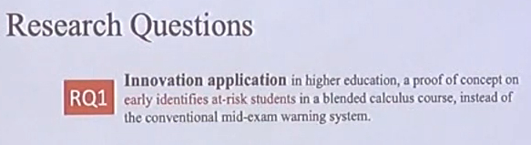

# 12

# 13
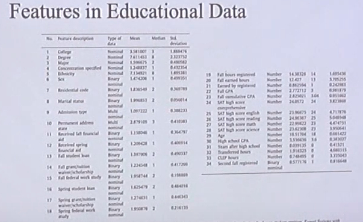

# 14
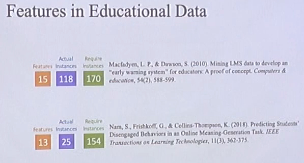

# 15
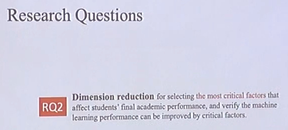

# 16

# 17

# 18
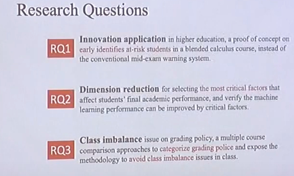

# 19

# 20

# 21
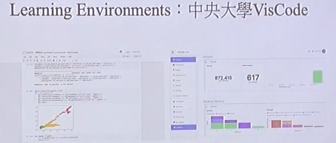

# 22
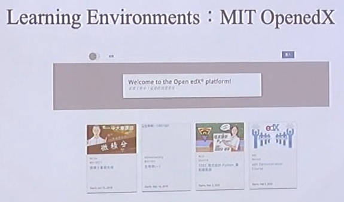

# 23
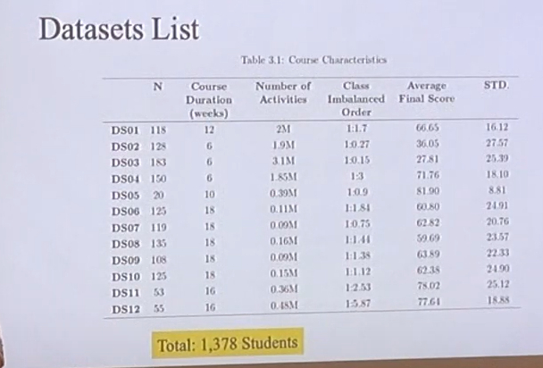

# 24

# 25

# 26

# 27

# 28

# 29
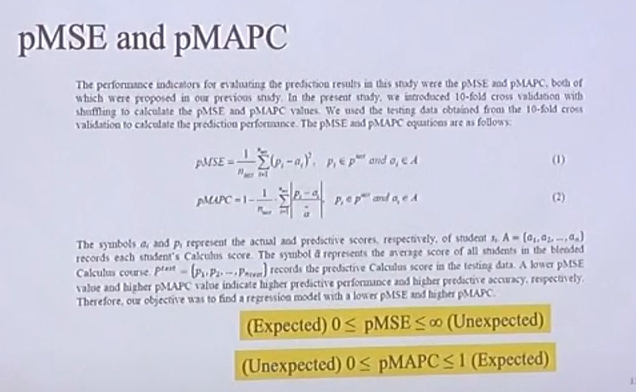

# 30

# 31
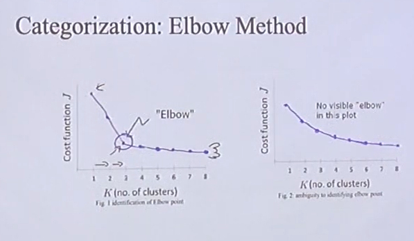

# 32
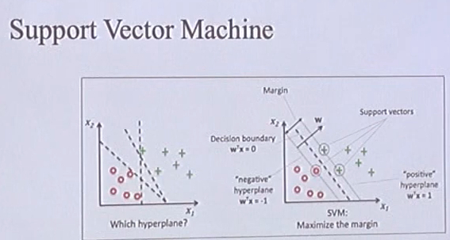

# 33
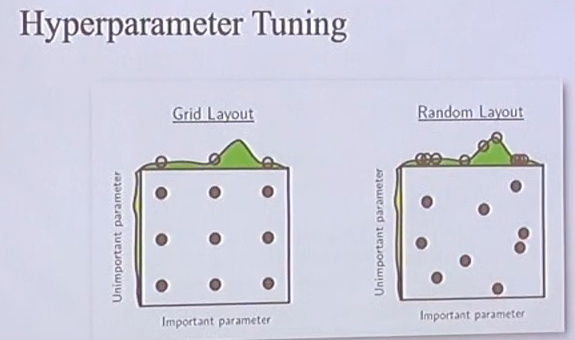

# 34
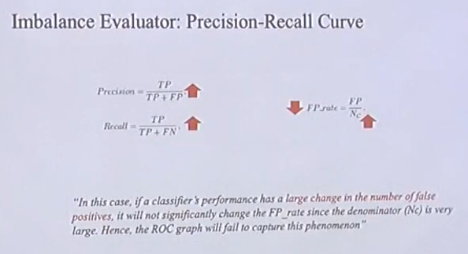

# 35

# 36
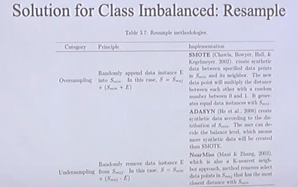

# 37

# 38
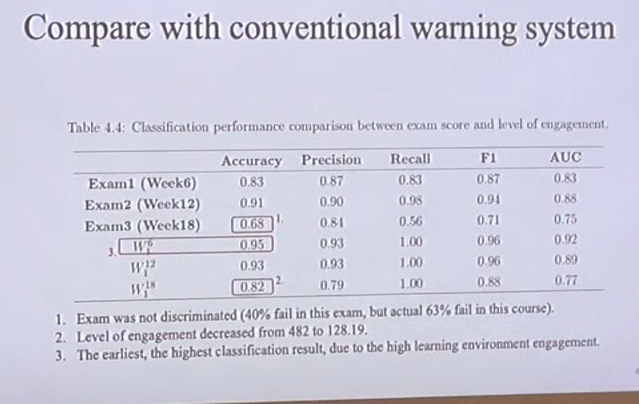

# 39
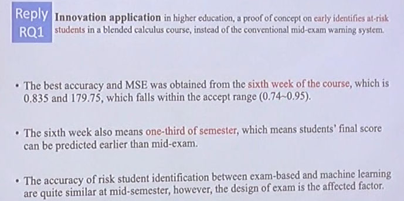

# 40

# 41

# 42

# 43

# 44

# 45

# 46
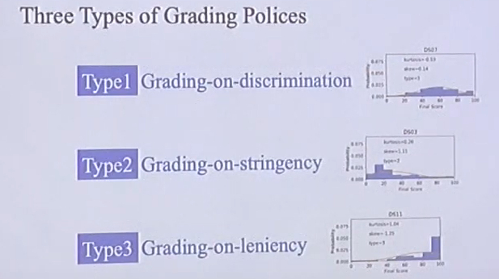

# 47

# 48

# 49
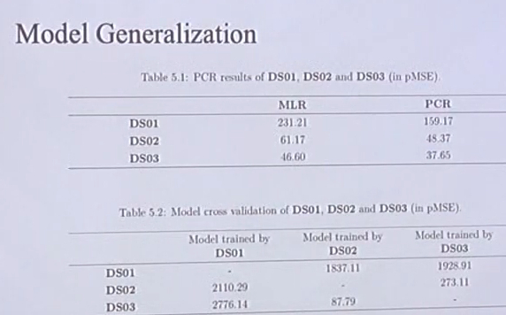

# 50
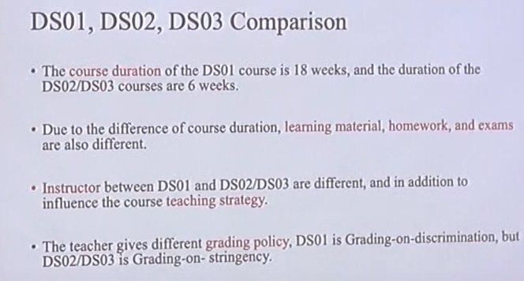

# 51
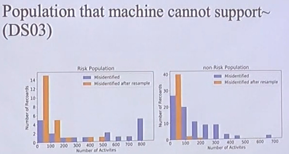

# 52

# 53
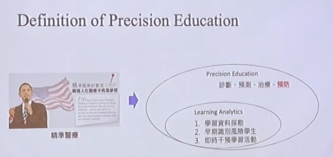

# 54
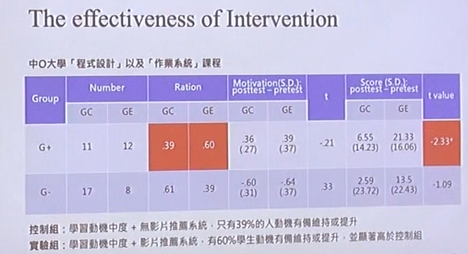

# 55
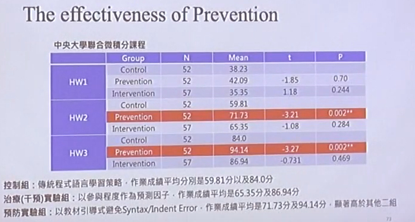

# 56
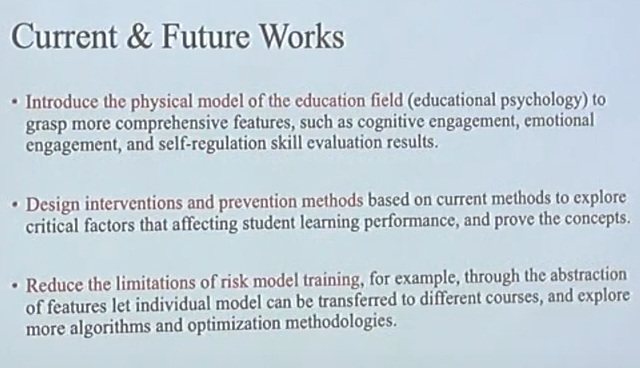

# 57

# 58
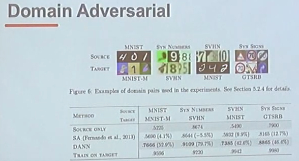

# 59

# 60

# 61

# 62

# 63

# 64

# 65

# 66

# 67

# 68

# 69

# 70

# 71

# 72

# 73

# 74

# 75

